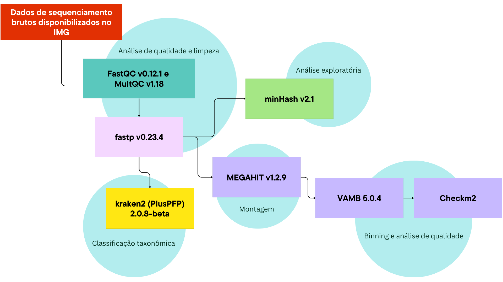

# Explorando metagenomas de jardins de fungos cultivados por formigas-cortadeiras do gênero Atta para a descoberta de novos antifúngicos (Simpósio EcoEvoBio 2026)

Este repositório foi criado para documentar e garantir a reprodutibilidade do projeto apresentado no I Simpósio EcoEvoBio.

Autores (github)
- Julia Braga Amaro ([@jbraagaa](https://github.com/jbraagaa))
- Fábio Rodrigo de Freitas ([@FabioRFreitas](https://github.com/FabioRFreitas))
- Julia Ferreira Santos ([@lia002ju](https://github.com/lia002ju))
- Renato Augusto Corrêa dos Santos ([@SantosRAC](https://github.com/SantosRAC))

Laboratório de Bioinformática e Multi-ômicas de Microrganismos (LBMM), Instituto de Biociências (IB) de Rio Claro, Universidade Estadual Paulista Júlio de Mesquita Filho (UNESP)

## Descrição 🧬🧫🐜

Embora metagenomas de jardins de espécies de Atta já tenham sido sequenciados, eles ainda não foram explorados para a descoberta de antifúngicos, tampouco para estudar o potencial funcional de bactérias em grupos taxonômicos ainda não conhecidos e/ou não cultivados. O presente trabalho pretende compreender as diferenças funcionais, principalmente relacionado a produção de antifúngicos identificados por BGCs, entre os microrganismos comuns e da Matéria Escura Microbiana associadas às formigas cultivadoras de fungos. As amostras de metagenomas foram montados a partir dos dados proveniêntes do trabalho de Khadempur et al. (2020).

## Workflow 🖥️🧬⚙️

Fluxograma contendo as ferramentas utilizadas

Confira o passo a passo utilizado em:

*Os scripts utilizados para a criação dos gráficos estão na pasta scripts.

O passo a passo completo está no [PDF exportado da plataforma Notion](2f06e8eb-fedf-4fb9-8f7e-a03fbd5f289e_EcoEvoBio2026_-_Anlises.pdf).

## Agradecimentos

O presente trabalho foi realizado com apoio da Fundação de Amparo à Pesquisa do Estado de São Paulo (FAPESP), Brasil (processos nº 2024/19418-0 e 2026/00858-5).

Esse trabalho usou recursos do "Centro Nacional de Processamento de Alto Desempenho em São Paulo (CENAPAD-SP)."

Esta pesquisa tornou-se possível graças aos recursos computacionais disponibilizados pelo Núcleo de Computação Científica (NCC/GridUNESP) da Universidade Estadual Paulista (UNESP).
